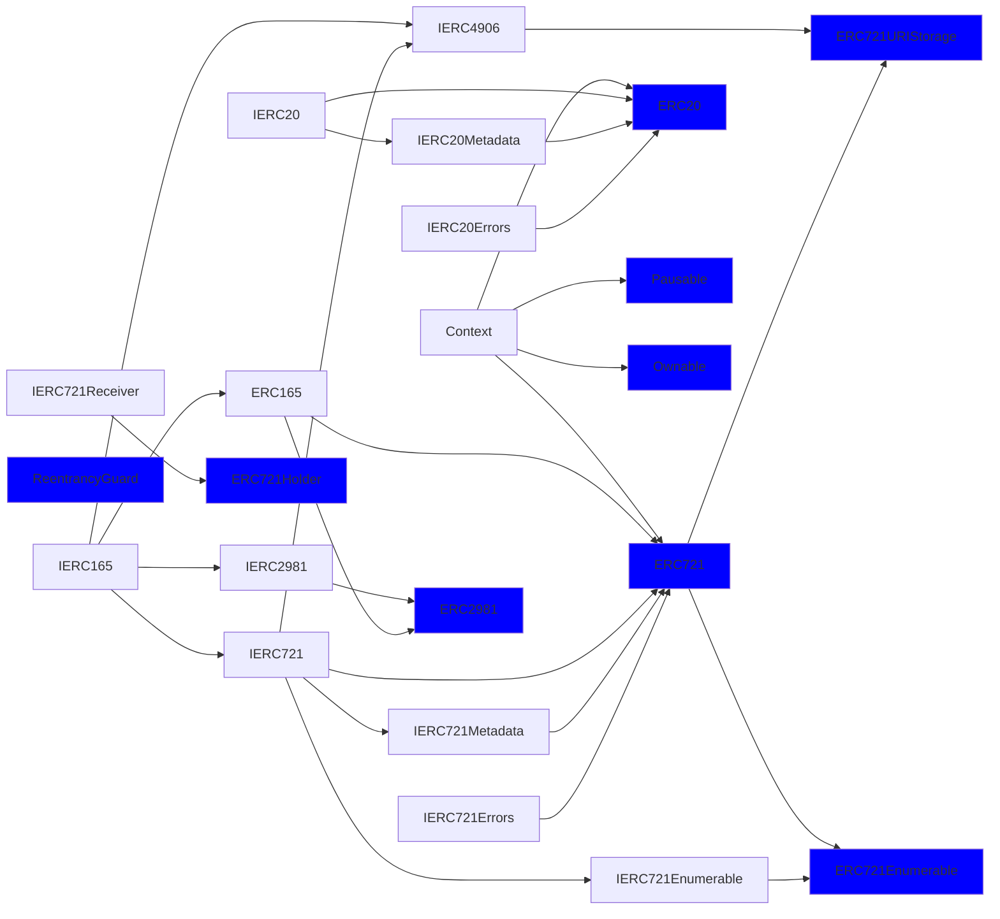

```mermaid
flowchart LR
ERC721URIStorage_f5609e3d1a31b96c4ae3e96b61ff8708[ERC721URIStorage]:::changed
IERC4906_f0c0acc4e2b89551d43d539baaa2f381 --> ERC721URIStorage_f5609e3d1a31b96c4ae3e96b61ff8708
ERC721_3e1edce4acc13e2bf6024e1b6e557740 --> ERC721URIStorage_f5609e3d1a31b96c4ae3e96b61ff8708

ERC20_92a73b25263b91948652352b515e2f37[ERC20]:::changed
Context_fad8e9b1abe1a447cc7d3e3d859f598b --> ERC20_92a73b25263b91948652352b515e2f37
IERC20_b53196586ed982f9c59eb5d295b1bf5b --> ERC20_92a73b25263b91948652352b515e2f37
IERC20Metadata_3b716480a57c2786fb1640f6a7cf28b0 --> ERC20_92a73b25263b91948652352b515e2f37
IERC20Errors_198b29296359e123ed30e792ba9d8c66 --> ERC20_92a73b25263b91948652352b515e2f37

ERC721_3e1edce4acc13e2bf6024e1b6e557740[ERC721]:::changed
Context_fad8e9b1abe1a447cc7d3e3d859f598b --> ERC721_3e1edce4acc13e2bf6024e1b6e557740
ERC165_0f41373ac034617f567e897a317eb311 --> ERC721_3e1edce4acc13e2bf6024e1b6e557740
IERC721_a33b6e4f75fe5bb684b3308d85256928 --> ERC721_3e1edce4acc13e2bf6024e1b6e557740
IERC721Metadata_affc58fdc9aae4aa47a2e51017bf7763 --> ERC721_3e1edce4acc13e2bf6024e1b6e557740
IERC721Errors_198b29296359e123ed30e792ba9d8c66 --> ERC721_3e1edce4acc13e2bf6024e1b6e557740

Pausable_cdc99a4a65e5b857a88dc2d2a90e559d[Pausable]:::changed
Context_fad8e9b1abe1a447cc7d3e3d859f598b --> Pausable_cdc99a4a65e5b857a88dc2d2a90e559d

Ownable_756722ab1e13ef8652b63db557150e11[Ownable]:::changed
Context_fad8e9b1abe1a447cc7d3e3d859f598b --> Ownable_756722ab1e13ef8652b63db557150e11

ERC721Enumerable_a402cd4d1cde68d4d56d7734c0f90185[ERC721Enumerable]:::changed
ERC721_3e1edce4acc13e2bf6024e1b6e557740 --> ERC721Enumerable_a402cd4d1cde68d4d56d7734c0f90185
IERC721Enumerable_8d4a083abd865bec4508fc7995262488 --> ERC721Enumerable_a402cd4d1cde68d4d56d7734c0f90185

ERC721Holder_a9f0b137cdcd7a1ad692f904e5efe866[ERC721Holder]:::changed
IERC721Receiver_c44f4808044f616b2546831fde0fd799 --> ERC721Holder_a9f0b137cdcd7a1ad692f904e5efe866

ReentrancyGuard_33ca109cbf52553509267cf64526545a[ReentrancyGuard]:::changed

ERC2981_e05a2cd78fb920a4e590554eec64e2e5[ERC2981]:::changed
IERC2981_4a2ad674a1a65f0e229bea80a0503b11 --> ERC2981_e05a2cd78fb920a4e590554eec64e2e5
ERC165_0f41373ac034617f567e897a317eb311 --> ERC2981_e05a2cd78fb920a4e590554eec64e2e5

IERC4906_f0c0acc4e2b89551d43d539baaa2f381[IERC4906]
IERC165_b396c11f59b028a923dc5de5e2a57327 --> IERC4906_f0c0acc4e2b89551d43d539baaa2f381
IERC721_a33b6e4f75fe5bb684b3308d85256928 --> IERC4906_f0c0acc4e2b89551d43d539baaa2f381

Context_fad8e9b1abe1a447cc7d3e3d859f598b[Context]

IERC20_b53196586ed982f9c59eb5d295b1bf5b[IERC20]

IERC20Metadata_3b716480a57c2786fb1640f6a7cf28b0[IERC20Metadata]
IERC20_b53196586ed982f9c59eb5d295b1bf5b --> IERC20Metadata_3b716480a57c2786fb1640f6a7cf28b0

IERC20Errors_198b29296359e123ed30e792ba9d8c66[IERC20Errors]

ERC165_0f41373ac034617f567e897a317eb311[ERC165]
IERC165_b396c11f59b028a923dc5de5e2a57327 --> ERC165_0f41373ac034617f567e897a317eb311

IERC721_a33b6e4f75fe5bb684b3308d85256928[IERC721]
IERC165_b396c11f59b028a923dc5de5e2a57327 --> IERC721_a33b6e4f75fe5bb684b3308d85256928

IERC721Metadata_affc58fdc9aae4aa47a2e51017bf7763[IERC721Metadata]
IERC721_a33b6e4f75fe5bb684b3308d85256928 --> IERC721Metadata_affc58fdc9aae4aa47a2e51017bf7763

IERC721Errors_198b29296359e123ed30e792ba9d8c66[IERC721Errors]

IERC721Enumerable_8d4a083abd865bec4508fc7995262488[IERC721Enumerable]
IERC721_a33b6e4f75fe5bb684b3308d85256928 --> IERC721Enumerable_8d4a083abd865bec4508fc7995262488

IERC721Receiver_c44f4808044f616b2546831fde0fd799[IERC721Receiver]

IERC2981_4a2ad674a1a65f0e229bea80a0503b11[IERC2981]
IERC165_b396c11f59b028a923dc5de5e2a57327 --> IERC2981_4a2ad674a1a65f0e229bea80a0503b11

IERC165_b396c11f59b028a923dc5de5e2a57327[IERC165]

classDef changed fill:blue
```
